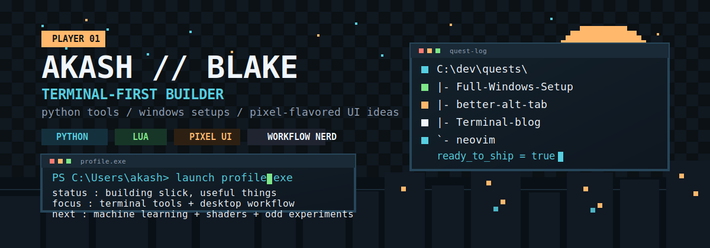

<p align="center">
  
</p>

<p align="center">
  <a href="https://github.com/akash-bhaduri?tab=followers"></a>
  <a href="https://github.com/akash-bhaduri"></a>
  <a href="https://github.com/akash-bhaduri/Terminal-blog"></a>
  <a href="https://github.com/akash-bhaduri/Full-Windows-Setup"></a>
</p>

<br>

<table border="0">
<tr>
<td width="55%" valign="top">

## `> whoami`

> Terminal-first developer building useful things with a bit of game UI energy. 

I spend most of my time on **Python automation**, **Machine Learning**, **Windows setup experiments**, **NeoVim workflows**, and buuilding Llms that feel fast, tactile, and clean.

```yaml
alias:      Akash / BLAKE
core_stack: [Python, Lua, HTML/CSS, Git]
currently:  [Building llms, setup repos, visual experiments]
learning:   [machine learning, shaders, deeper Lua]
```

</td>
<td width="45%" valign="top">

## `> loadout`

<p align="left">
  <b>Languages & Core</b><br>
  
</p>
<p align="left">
  <b>Tools & Environment</b><br>
  
</p>

## `> side_quests`

- Books and stylized visuals
- Interface polish with retro flavor
- Turning tiny ideas into shippable tools

</td>
</tr>
</table>

<br>

## `> journey.log`

```text
[SYSTEM] :: initializing curiosity...
[SUCCESS] :: learning by taking tools apart.
```

I started opening configs, tweaking terminals, breaking things, and rebuilding them just to understand how the pieces fit together. That curiosity slowly turned into a habit: learn by taking tools apart, then shape them into something faster, cleaner, and more personal. 

That is what pushed me toward **Python automation**, **NeoVim workflows**, **Windows customization**, and the kind of small projects where both utility and style matter.

<br>

## `> main_quests`

<div align="center">
  <a href="https://github.com/akash-bhaduri/Full-Windows-Setup">
    
  </a>
  <a href="https://github.com/akash-bhaduri/better-alt-tab">
    
  </a>
  <br />
  <a href="https://github.com/akash-bhaduri/Terminal-blog">
    
  </a>
  <a href="https://github.com/akash-bhaduri/neovim">
    
  </a>
</div>

<details>
<summary><b><code>> view_quest_log()</code></b></summary>
<br>

-  Building more projects that mix utility with style
-  Exploring machine learning without losing the hands-on builder mindset
-  Pushing terminal and desktop setups until they feel like products

</details>

<br>

## `> xp_board`

<div align="center">
  
  
  <br />
  
</div>

<br>

## `> portals`

<p align="center">
  <a href="https://github.com/akash-bhaduri"><code>GitHub</code></a> •
  <a href="https://akash-qn4m.onrender.com"><code>Site</code></a> •
  <a href="https://github.com/akash-bhaduri/Terminal-blog"><code>Terminal Blog</code></a> •
  <a href="https://github.com/akash-bhaduri/windows-terminal-config"><code>Terminal Config</code></a>
</p>

<p align="center">
  
</p>

<p align="center">
  <sub>Built to feel like a save screen from a developer RPG.</sub>
</p>
